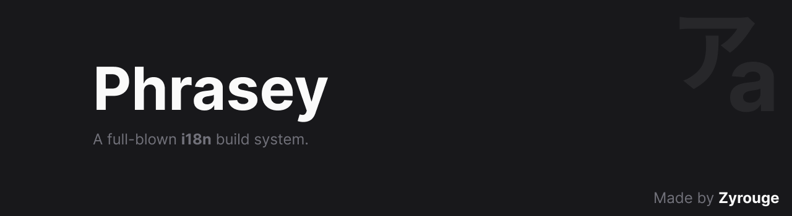

# Phrasey

A full-blown i18n build system.

Get started by visiting [What is Phrasey?](https://zyrouge.github.io/phrasey/getting-started/) and [Setup](https://zyrouge.github.io/phrasey/getting-started/setup.html).

## Links

-   [Documentation](https://zyrouge.github.io/phrasey/)
-   [Github](https://github.com/zyrouge/phrasey/)
-   [NPM](https://npmjs.com/package/phrasey/)

## Repository Architecture

-   [pharsey](./src)
-   [@zyrouge/phrasey-json](./subpackages/phrasey-json/)
-   [@zyrouge/phrasey-yaml](./subpackages/phrasey-yaml/)
-   [@zyrouge/phrasey-toml](./subpackages/phrasey-toml/)
-   [@zyrouge/phrasey-xml](./subpackages/phrasey-xml/)
-   [docs](./docs)

## License

[MIT](./LICENSE)
